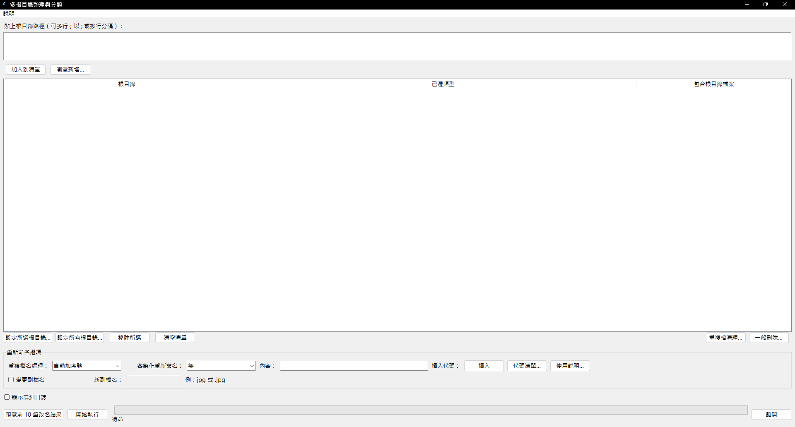

# 整理檔案工具 (File Organizer)

這是一款 **多根目錄檔案整理與分類工具**，提供直覺化的圖形介面，方便快速整理電腦中的檔案。  

## ✨ 功能特色
- 支援多個根目錄批次整理  
- 自動依照副檔名分類檔案  
- 可自訂重新命名規則（支援代碼插入，如日期、原始檔名、父資料夾等）  
- 重複檔案清理（MD5 比對 + 保留策略）  
- 規則刪除工具（大小、天數、關鍵字過濾）  
- 空資料夾自動清理  
- 進度條與預計完成時間顯示  

## 🖼️ 使用畫面
  
（此處可放 GUI 介面截圖）

## 🚀 使用方式
1. 執行 `整理檔案.exe`（可直接使用打包好的版本）  
2. 貼上或選擇要整理的根目錄  
3. 設定分類規則與命名選項  
4. 點擊 **開始執行**  

## 🔧 技術細節
- 使用 `Python 3.11` 開發  
- GUI 介面基於 `Tkinter`  
- 打包方式： [Nuitka](https://nuitka.net/)（內含 Python 環境，免安裝即可執行）  

## 📥 更新方式
程式內建自動更新檢查，會連線至本 GitHub 儲存庫下載最新版本。  

## 📜 授權
本專案僅供學習與個人使用，禁止未經授權的商業用途。
